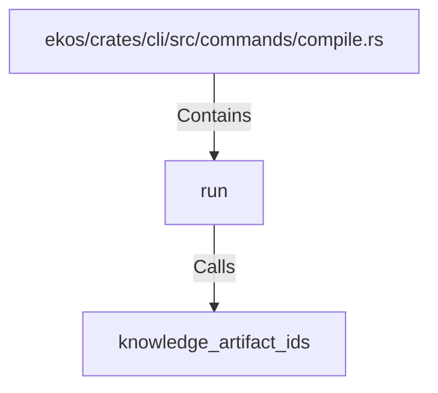

# run (RustSymbol)

## Properties

| Key | Value |
|---|---|
| `kind` | function |

## Relationships

### Calls

- → knowledge_artifact_ids (`73ef30b8-ee53-5d22-bd37-3852adb53122`)

### Contains

- ← ekos/crates/cli/src/commands/compile.rs (`187a8810-a032-5178-ac4c-33a24e5cc42a`)

## Diagram

## Evidence

_No evidence cited._
