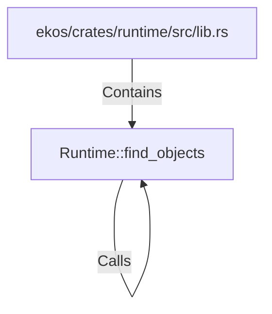

# Runtime::find_objects (RustSymbol)

## Properties

| Key | Value |
|---|---|
| `kind` | method |

## Relationships

### Calls

- → Runtime::find_objects (`ce13a654-8989-5e3e-8483-fe424dcd2dc5`)

### Contains

- ← ekos/crates/runtime/src/lib.rs (`7d8cf6bd-fac1-56d9-a742-4db7a455ab7c`)

## Diagram

## Evidence

_No evidence cited._
