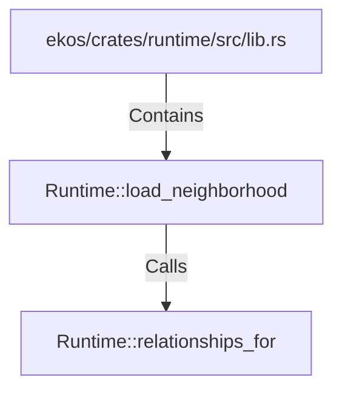

# Runtime::load_neighborhood (RustSymbol)

## Properties

| Key | Value |
|---|---|
| `kind` | method |

## Relationships

### Calls

- → Runtime::relationships_for (`a00bd86c-0a12-596a-ac7c-f7efdaf09587`)

### Contains

- ← ekos/crates/runtime/src/lib.rs (`7d8cf6bd-fac1-56d9-a742-4db7a455ab7c`)

## Diagram

## Evidence

_No evidence cited._
