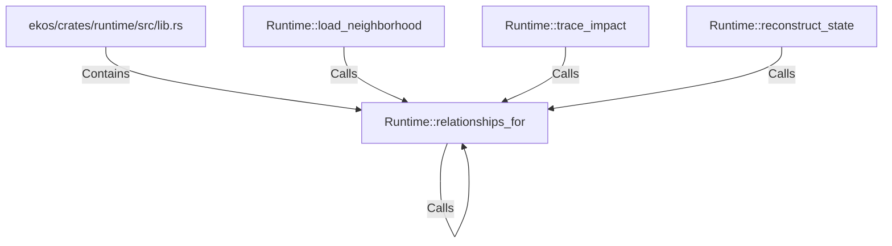

# Runtime::relationships_for (RustSymbol)

## Properties

| Key | Value |
|---|---|
| `kind` | method |

## Relationships

### Calls

- ← Runtime::load_neighborhood (`3c4521a1-ba17-5696-bba7-81bb51c6c9ac`)
- ← Runtime::trace_impact (`5d6094ff-9249-5f7c-bd00-8def835f3b26`)
- ← Runtime::reconstruct_state (`a6e52ef6-a975-5d01-b32d-198475672149`)
- → Runtime::relationships_for (`a00bd86c-0a12-596a-ac7c-f7efdaf09587`)

### Contains

- ← ekos/crates/runtime/src/lib.rs (`7d8cf6bd-fac1-56d9-a742-4db7a455ab7c`)

## Diagram

## Evidence

_No evidence cited._
