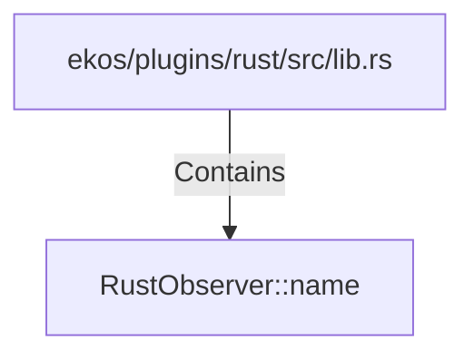

# RustObserver::name (RustSymbol)

## Properties

| Key | Value |
|---|---|
| `kind` | method |

## Relationships

### Contains

- ← ekos/plugins/rust/src/lib.rs (`1a06302f-f373-5d4e-9592-3d99844910e8`)

## Diagram

## Evidence

_No evidence cited._
