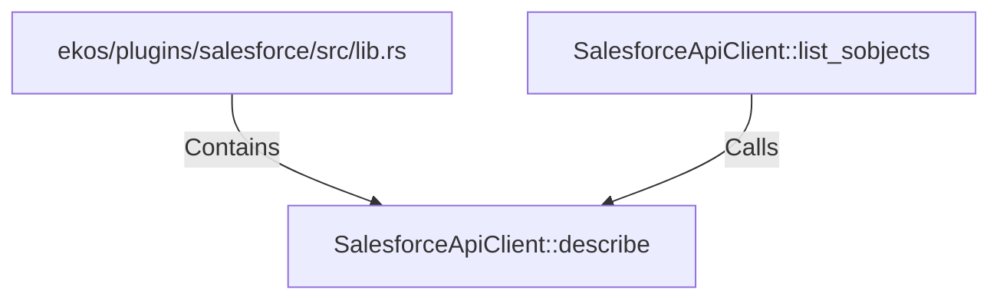

# SalesforceApiClient::describe (RustSymbol)

## Properties

| Key | Value |
|---|---|
| `kind` | method |

## Relationships

### Calls

- ← SalesforceApiClient::list_sobjects (`36ea62f1-6cb5-5fd3-84a2-d7731119525a`)

### Contains

- ← ekos/plugins/salesforce/src/lib.rs (`62e147c2-5a91-534c-98ac-6557560db8f6`)

## Diagram

## Evidence

_No evidence cited._
