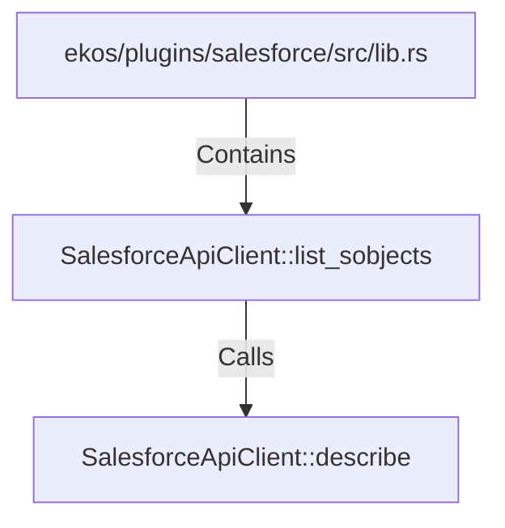

# SalesforceApiClient::list_sobjects (RustSymbol)

## Properties

| Key | Value |
|---|---|
| `kind` | method |

## Relationships

### Calls

- → SalesforceApiClient::describe (`7bd16300-a1d8-5b35-8d4b-e4af18e95ffe`)

### Contains

- ← ekos/plugins/salesforce/src/lib.rs (`62e147c2-5a91-534c-98ac-6557560db8f6`)

## Diagram

## Evidence

_No evidence cited._
