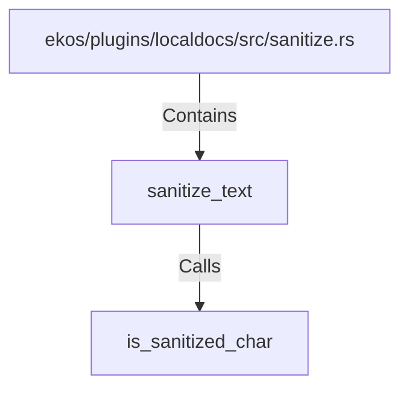

# sanitize_text (RustSymbol)

## Properties

| Key | Value |
|---|---|
| `kind` | function |

## Relationships

### Calls

- → is_sanitized_char (`af5a215a-cc4d-533a-9bf8-38e0b0f284bd`)

### Contains

- ← ekos/plugins/localdocs/src/sanitize.rs (`553107f9-391e-5d35-83aa-e13b13604114`)

## Diagram

## Evidence

_No evidence cited._
