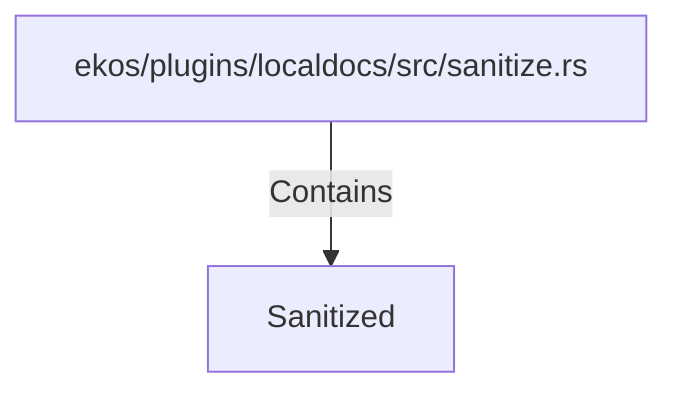

# Sanitized (RustSymbol)

## Properties

| Key | Value |
|---|---|
| `kind` | struct |

## Relationships

### Contains

- ← ekos/plugins/localdocs/src/sanitize.rs (`553107f9-391e-5d35-83aa-e13b13604114`)

## Diagram

## Evidence

_No evidence cited._
