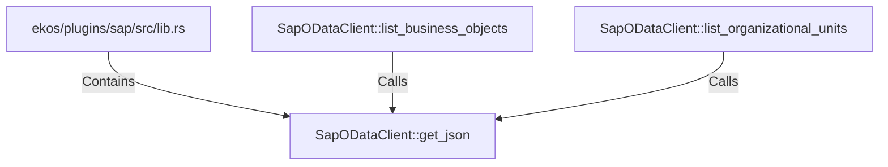

# SapODataClient::get_json (RustSymbol)

## Properties

| Key | Value |
|---|---|
| `kind` | method |

## Relationships

### Calls

- ← SapODataClient::list_business_objects (`53d863ca-386a-5e9e-81e9-aca8faaee7a1`)
- ← SapODataClient::list_organizational_units (`ecbe65cb-b5e4-57ad-aa7a-3c07155c1b75`)

### Contains

- ← ekos/plugins/sap/src/lib.rs (`8ce136d7-2eb9-53fd-90c2-7d0d00aeb27d`)

## Diagram

## Evidence

_No evidence cited._
