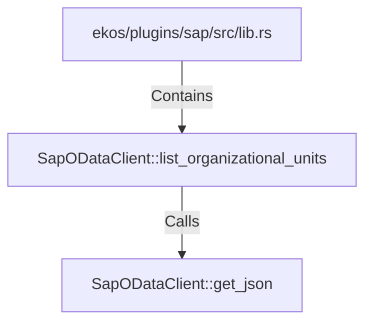

# SapODataClient::list_organizational_units (RustSymbol)

## Properties

| Key | Value |
|---|---|
| `kind` | method |

## Relationships

### Calls

- → SapODataClient::get_json (`2bc9e5ae-60cd-5c5f-833d-ac55e39e19f3`)

### Contains

- ← ekos/plugins/sap/src/lib.rs (`8ce136d7-2eb9-53fd-90c2-7d0d00aeb27d`)

## Diagram

## Evidence

_No evidence cited._
