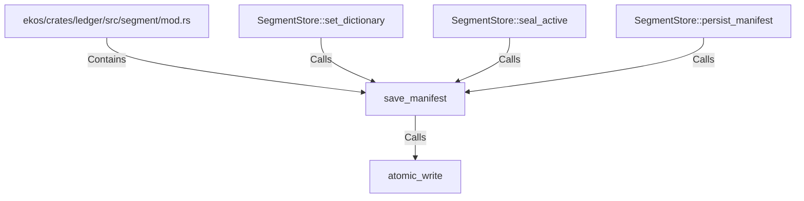

# save_manifest (RustSymbol)

## Properties

| Key | Value |
|---|---|
| `kind` | function |

## Relationships

### Calls

- ← SegmentStore::set_dictionary (`2b91f5c6-37e4-54ff-9f4b-735785f13c04`)
- ← SegmentStore::seal_active (`f2a44d2b-2547-5a57-b0b3-ec7494028286`)
- ← SegmentStore::persist_manifest (`f95100d5-153e-5cba-a18c-3f4cc681d1d1`)
- → atomic_write (`71c4923a-8f1e-587c-a91a-37769f53c149`)

### Contains

- ← ekos/crates/ledger/src/segment/mod.rs (`80a64e0a-b0ac-51df-b3be-128cddd1cc83`)

## Diagram

## Evidence

_No evidence cited._
