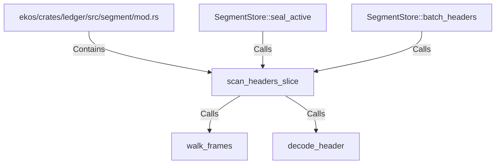

# scan_headers_slice (RustSymbol)

## Properties

| Key | Value |
|---|---|
| `kind` | function |

## Relationships

### Calls

- ← SegmentStore::seal_active (`f2a44d2b-2547-5a57-b0b3-ec7494028286`)
- ← SegmentStore::batch_headers (`18f1b204-1468-5fdb-a06f-d7baad93b9f6`)
- → walk_frames (`630f07e4-a407-59c6-bdb6-e7ed592a703b`)
- → decode_header (`c0caddb8-2278-5f35-b313-f93159e56dbf`)

### Contains

- ← ekos/crates/ledger/src/segment/mod.rs (`80a64e0a-b0ac-51df-b3be-128cddd1cc83`)

## Diagram

## Evidence

_No evidence cited._
