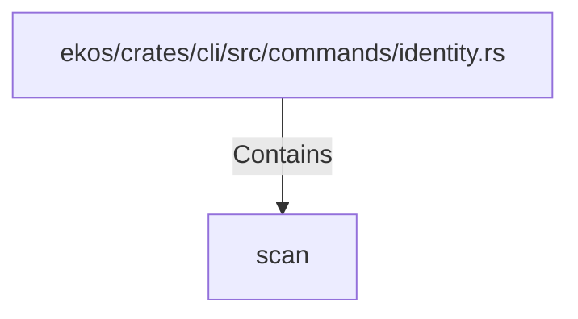

# scan (RustSymbol)

## Properties

| Key | Value |
|---|---|
| `kind` | function |

## Relationships

### Contains

- ← ekos/crates/cli/src/commands/identity.rs (`f6e3418b-d664-536b-8a69-b723a534ff1a`)

## Diagram

## Evidence

_No evidence cited._
