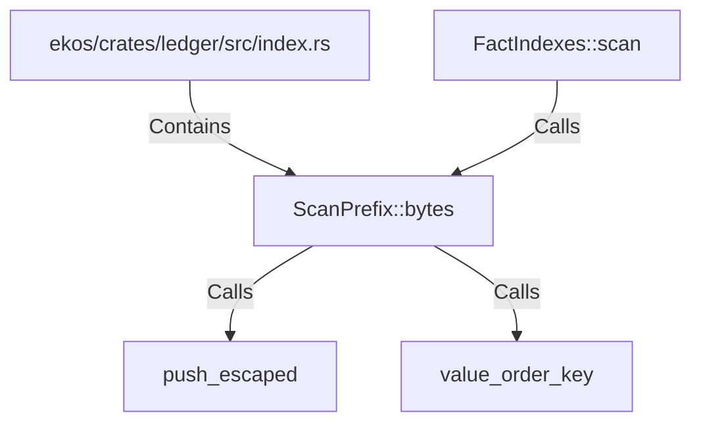

# ScanPrefix::bytes (RustSymbol)

## Properties

| Key | Value |
|---|---|
| `kind` | method |

## Relationships

### Calls

- → push_escaped (`479cc024-8a4a-58db-9137-6a0b043be5e8`)
- → value_order_key (`9a9ea627-8891-52e2-a6a7-1ade17a48fa6`)
- ← FactIndexes::scan (`a6eecec9-893d-552b-9d21-a9ca35b1c87d`)

### Contains

- ← ekos/crates/ledger/src/index.rs (`a43fa387-2cac-5166-bfc2-ae4c965fc2ac`)

## Diagram

## Evidence

_No evidence cited._
