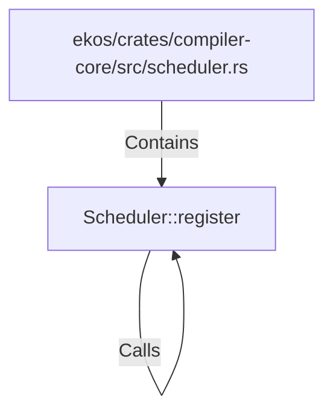

# Scheduler::register (RustSymbol)

## Properties

| Key | Value |
|---|---|
| `kind` | method |

## Relationships

### Calls

- → Scheduler::register (`ee947ba6-f167-5999-b796-8cdaa2f16bdc`)

### Contains

- ← ekos/crates/compiler-core/src/scheduler.rs (`973894db-35d2-59ed-b82c-30ad335125cf`)

## Diagram

## Evidence

_No evidence cited._
