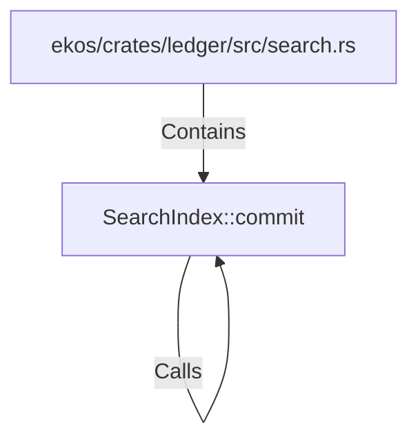

# SearchIndex::commit (RustSymbol)

## Properties

| Key | Value |
|---|---|
| `kind` | method |

## Relationships

### Calls

- → SearchIndex::commit (`0e0ad6b8-a07d-5782-87ca-73d912e3c83b`)

### Contains

- ← ekos/crates/ledger/src/search.rs (`b419f7f5-ae3b-50d7-9192-7ef6954555ce`)

## Diagram

## Evidence

_No evidence cited._
