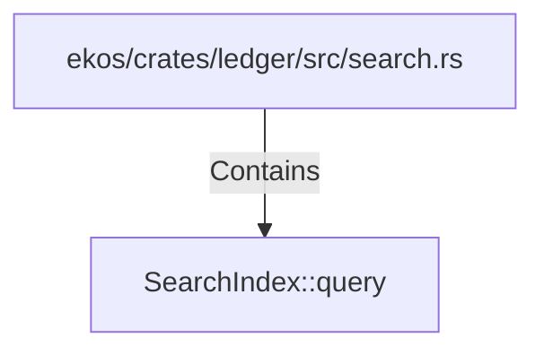

# SearchIndex::query (RustSymbol)

## Properties

| Key | Value |
|---|---|
| `kind` | method |

## Relationships

### Contains

- ← ekos/crates/ledger/src/search.rs (`b419f7f5-ae3b-50d7-9192-7ef6954555ce`)

## Diagram

## Evidence

_No evidence cited._
