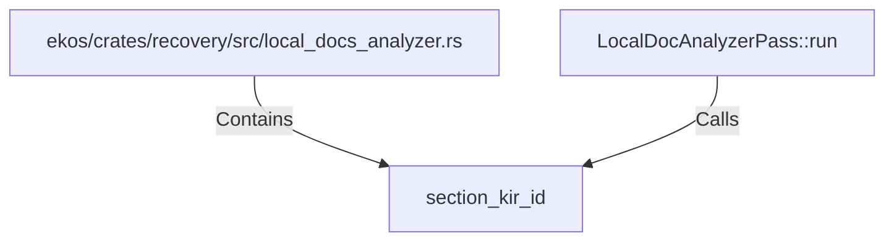

# section_kir_id (RustSymbol)

## Properties

| Key | Value |
|---|---|
| `kind` | function |

## Relationships

### Calls

- ← LocalDocAnalyzerPass::run (`86bb5764-03f3-5bb9-9846-0c13a60e457f`)

### Contains

- ← ekos/crates/recovery/src/local_docs_analyzer.rs (`d4eeb831-bfb8-592d-ad11-0e13adad2090`)

## Diagram

## Evidence

_No evidence cited._
