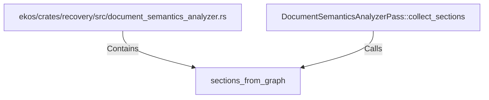

# sections_from_graph (RustSymbol)

## Properties

| Key | Value |
|---|---|
| `kind` | function |

## Relationships

### Calls

- ← DocumentSemanticsAnalyzerPass::collect_sections (`c02745f9-9504-5e9e-8788-41ab8d507547`)

### Contains

- ← ekos/crates/recovery/src/document_semantics_analyzer.rs (`62e92526-f096-5ed2-bc72-0bdae8703aa3`)

## Diagram

## Evidence

_No evidence cited._
