# segment_path (RustSymbol)

## Properties

| Key | Value |
|---|---|
| `kind` | function |

## Relationships

### Calls

- ← SegmentStore::open_with_seal_threshold (`f884dec9-a3e7-5e4e-88f6-1dc62c172078`)
- ← SegmentStore::seal_active (`f2a44d2b-2547-5a57-b0b3-ec7494028286`)
- ← SegmentStore::batches_after (`ecc4c700-b537-5187-a5a9-ee023b1d6bf4`)
- ← SegmentStore::batch_headers (`18f1b204-1468-5fdb-a06f-d7baad93b9f6`)
- ← SegmentStore::read_active_committed (`2119ef15-fc0f-5785-9e29-d84e4f14ac23`)
- ← SegmentStore::verify_sealed (`2ac5591d-1ae5-5ee2-8e32-44c92f6dae0d`)

### Contains

- ← ekos/crates/ledger/src/segment/mod.rs (`80a64e0a-b0ac-51df-b3be-128cddd1cc83`)

## Diagram

```mermaid
graph TD
    na07b97cc69e45c35bedf11119542af72["segment_path"]
    n80a64e0ab0ac51dfb3be128cddd1cc83["ekos/crates/ledger/src/segment/mod.rs"]
    n80a64e0ab0ac51dfb3be128cddd1cc83 -->|Contains| na07b97cc69e45c35bedf11119542af72
    nf884dec9a3e75e4e88f61dc62c172078["SegmentStore::open_with_seal_threshold"]
    nf884dec9a3e75e4e88f61dc62c172078 -->|Calls| na07b97cc69e45c35bedf11119542af72
    nf2a44d2b25475a57b0b3ec7494028286["SegmentStore::seal_active"]
    nf2a44d2b25475a57b0b3ec7494028286 -->|Calls| na07b97cc69e45c35bedf11119542af72
    necc4c700b5375187a5a9ee023b1d6bf4["SegmentStore::batches_after"]
    necc4c700b5375187a5a9ee023b1d6bf4 -->|Calls| na07b97cc69e45c35bedf11119542af72
    n18f1b20414685fdba06fd7baad93b9f6["SegmentStore::batch_headers"]
    n18f1b20414685fdba06fd7baad93b9f6 -->|Calls| na07b97cc69e45c35bedf11119542af72
    n2119ef15fc0f57859e29d84e4f14ac23["SegmentStore::read_active_committed"]
    n2119ef15fc0f57859e29d84e4f14ac23 -->|Calls| na07b97cc69e45c35bedf11119542af72
    n2ac5591d1ae55ee28e3244c92f6dae0d["SegmentStore::verify_sealed"]
    n2ac5591d1ae55ee28e3244c92f6dae0d -->|Calls| na07b97cc69e45c35bedf11119542af72
```

## Evidence

_No evidence cited._
