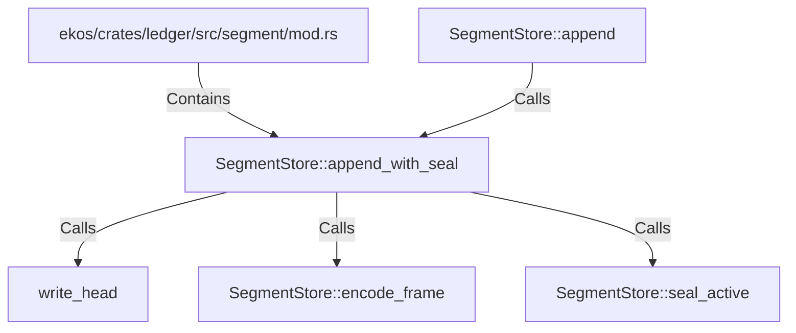

# SegmentStore::append_with_seal (RustSymbol)

## Properties

| Key | Value |
|---|---|
| `kind` | method |

## Relationships

### Calls

- ← SegmentStore::append (`b324f197-c4fc-5b55-89b4-22ca137bf445`)
- → write_head (`203436f8-4f5f-5f2b-93a8-b25fd11e5174`)
- → SegmentStore::encode_frame (`38292a24-6783-520d-a381-4370713746a4`)
- → SegmentStore::seal_active (`f2a44d2b-2547-5a57-b0b3-ec7494028286`)

### Contains

- ← ekos/crates/ledger/src/segment/mod.rs (`80a64e0a-b0ac-51df-b3be-128cddd1cc83`)

## Diagram

## Evidence

_No evidence cited._
