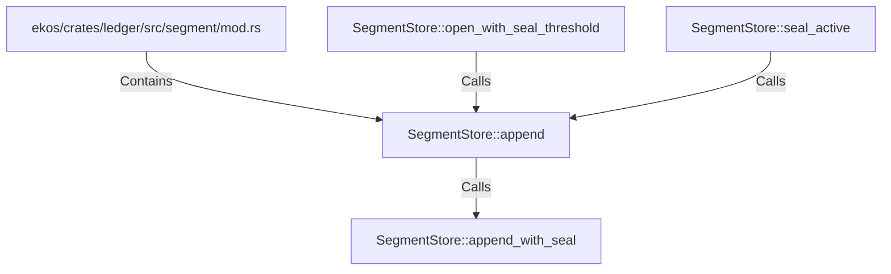

# SegmentStore::append (RustSymbol)

## Properties

| Key | Value |
|---|---|
| `kind` | method |

## Relationships

### Calls

- ← SegmentStore::open_with_seal_threshold (`f884dec9-a3e7-5e4e-88f6-1dc62c172078`)
- → SegmentStore::append_with_seal (`e15adeb3-bb2f-54d6-83ee-e79281bea443`)
- ← SegmentStore::seal_active (`f2a44d2b-2547-5a57-b0b3-ec7494028286`)

### Contains

- ← ekos/crates/ledger/src/segment/mod.rs (`80a64e0a-b0ac-51df-b3be-128cddd1cc83`)

## Diagram

## Evidence

_No evidence cited._
