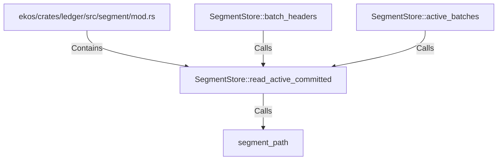

# SegmentStore::read_active_committed (RustSymbol)

## Properties

| Key | Value |
|---|---|
| `kind` | method |

## Relationships

### Calls

- ← SegmentStore::batch_headers (`18f1b204-1468-5fdb-a06f-d7baad93b9f6`)
- → segment_path (`a07b97cc-69e4-5c35-bedf-11119542af72`)
- ← SegmentStore::active_batches (`4129d5a0-4d0d-52d4-a36e-ea91694c7f1f`)

### Contains

- ← ekos/crates/ledger/src/segment/mod.rs (`80a64e0a-b0ac-51df-b3be-128cddd1cc83`)

## Diagram

## Evidence

_No evidence cited._
