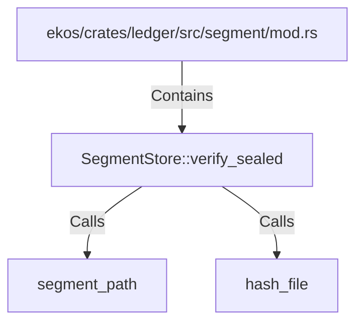

# SegmentStore::verify_sealed (RustSymbol)

## Properties

| Key | Value |
|---|---|
| `kind` | method |

## Relationships

### Calls

- → segment_path (`a07b97cc-69e4-5c35-bedf-11119542af72`)
- → hash_file (`a95eaa64-3902-5bdf-905e-c2436d2c8cc4`)

### Contains

- ← ekos/crates/ledger/src/segment/mod.rs (`80a64e0a-b0ac-51df-b3be-128cddd1cc83`)

## Diagram

## Evidence

_No evidence cited._
