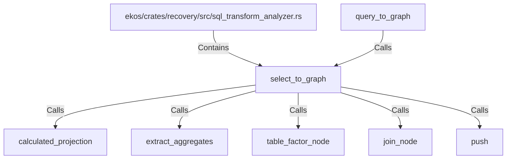

# select_to_graph (RustSymbol)

## Properties

| Key | Value |
|---|---|
| `kind` | function |

## Relationships

### Calls

- ← query_to_graph (`f816648e-a2ad-50bd-bd73-494fdbbbad49`)
- → calculated_projection (`6b551d77-f70b-5867-8c24-e9593a282f1d`)
- → extract_aggregates (`4f3d3e2a-8b6d-57b9-a2f2-6c57d683e86f`)
- → table_factor_node (`e24f2073-e41e-5300-bc61-d0729092e131`)
- → join_node (`7eaa67f6-5bf6-5400-9b69-a65cf91f7e66`)
- → push (`cc223cbc-9afd-5086-9f88-8c6d484895d1`)

### Contains

- ← ekos/crates/recovery/src/sql_transform_analyzer.rs (`987e3fbb-31ec-576d-b794-7e801336e8c8`)

## Diagram

## Evidence

_No evidence cited._
