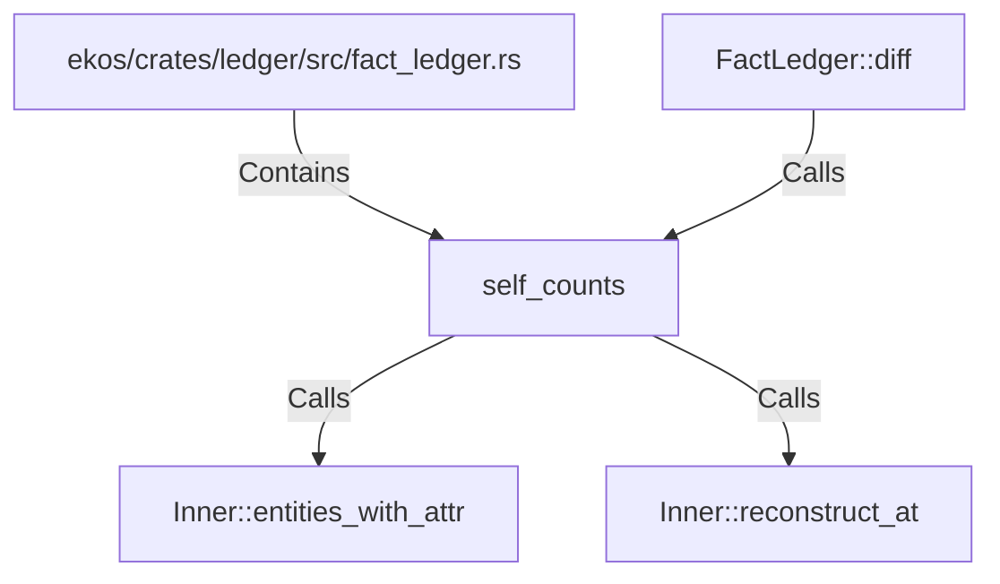

# self_counts (RustSymbol)

## Properties

| Key | Value |
|---|---|
| `kind` | function |

## Relationships

### Calls

- ← FactLedger::diff (`499f0ae3-66da-5863-8b37-46030a99f8e2`)
- → Inner::entities_with_attr (`b9448fb3-4dac-5309-ac98-0ad1ed35e6b0`)
- → Inner::reconstruct_at (`79bd7404-2990-533f-b4f5-b3d167543336`)

### Contains

- ← ekos/crates/ledger/src/fact_ledger.rs (`eadcb59e-818f-5d1e-af87-ff29aba11423`)

## Diagram

## Evidence

_No evidence cited._
