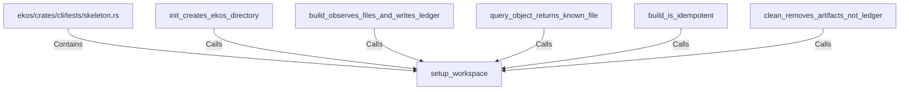

# setup_workspace (RustSymbol)

## Properties

| Key | Value |
|---|---|
| `kind` | function |

## Relationships

### Calls

- ← init_creates_ekos_directory (`83a765f7-1004-5a65-9fda-0e393a6a043b`)
- ← build_observes_files_and_writes_ledger (`8381b3cf-b4ab-5e24-b223-25b1e3647ee2`)
- ← query_object_returns_known_file (`41345ca4-9529-5fa7-994e-937f12f58595`)
- ← build_is_idempotent (`05d04030-4887-5de2-ab44-dff63a787efd`)
- ← clean_removes_artifacts_not_ledger (`c8408593-f6d8-5b70-8301-3485d093719e`)

### Contains

- ← ekos/crates/cli/tests/skeleton.rs (`c39b7026-a223-5e82-b5c8-7ed254f6ba84`)

## Diagram

## Evidence

_No evidence cited._
