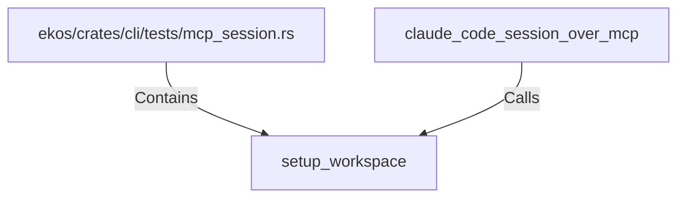

# setup_workspace (RustSymbol)

## Properties

| Key | Value |
|---|---|
| `kind` | function |

## Relationships

### Calls

- ← claude_code_session_over_mcp (`a0f174d3-a1ae-5c38-86aa-9920ae2beb45`)

### Contains

- ← ekos/crates/cli/tests/mcp_session.rs (`201efc61-073b-5bcd-a5a8-a6c476333729`)

## Diagram

## Evidence

_No evidence cited._
