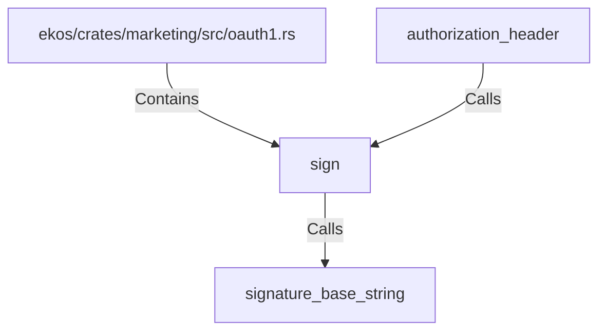

# sign (RustSymbol)

## Properties

| Key | Value |
|---|---|
| `kind` | function |

## Relationships

### Calls

- → signature_base_string (`26cd4cad-2e8c-57aa-8742-f30a3e5eea61`)
- ← authorization_header (`f41ca41a-4961-50d1-925e-01ca53aaa086`)

### Contains

- ← ekos/crates/marketing/src/oauth1.rs (`d9547f96-f031-5a9d-875d-5912db96b474`)

## Diagram

## Evidence

_No evidence cited._
