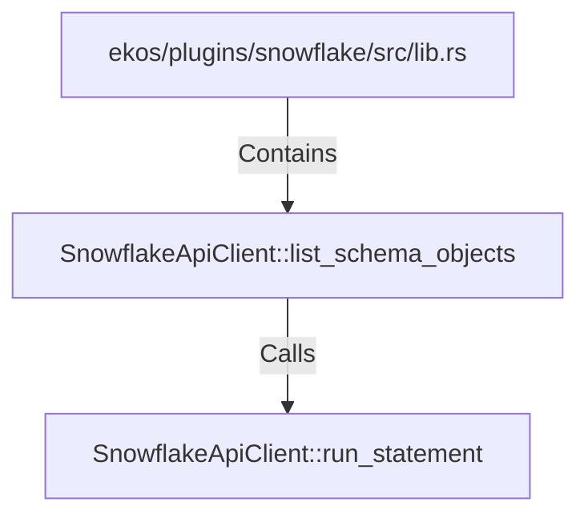

# SnowflakeApiClient::list_schema_objects (RustSymbol)

## Properties

| Key | Value |
|---|---|
| `kind` | method |

## Relationships

### Calls

- → SnowflakeApiClient::run_statement (`5558b018-132a-54e7-b5fb-86cb45667fcc`)

### Contains

- ← ekos/plugins/snowflake/src/lib.rs (`1f09ad6b-972d-56d7-9597-8641b250abce`)

## Diagram

## Evidence

_No evidence cited._
