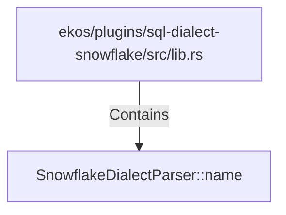

# SnowflakeDialectParser::name (RustSymbol)

## Properties

| Key | Value |
|---|---|
| `kind` | method |

## Relationships

### Contains

- ← ekos/plugins/sql-dialect-snowflake/src/lib.rs (`0417a4c7-1d0b-52f5-b2de-f52571e9dc2b`)

## Diagram

## Evidence

_No evidence cited._
