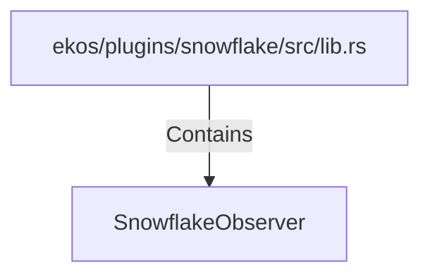

# SnowflakeObserver (RustSymbol)

## Properties

| Key | Value |
|---|---|
| `kind` | struct |

## Relationships

### Contains

- ← ekos/plugins/snowflake/src/lib.rs (`1f09ad6b-972d-56d7-9597-8641b250abce`)

## Diagram

## Evidence

_No evidence cited._
