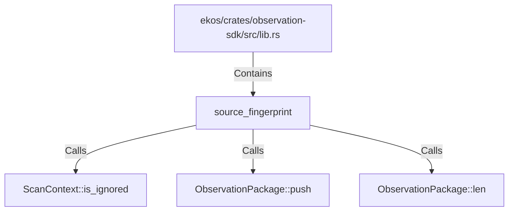

# source_fingerprint (RustSymbol)

## Properties

| Key | Value |
|---|---|
| `kind` | function |

## Relationships

### Calls

- → ScanContext::is_ignored (`8b666d11-3ab8-52b1-8b71-7cb270682a0b`)
- → ObservationPackage::push (`dd106f4a-4759-564d-835a-4d25afcf840e`)
- → ObservationPackage::len (`b4e4cbd9-d9f3-5d02-a4dc-0c11bdbedc05`)

### Contains

- ← ekos/crates/observation-sdk/src/lib.rs (`66ce958b-7250-5ec2-954e-eacf8f64aae0`)

## Diagram

## Evidence

_No evidence cited._
