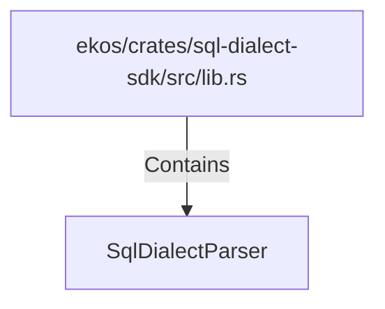

# SqlDialectParser (RustSymbol)

## Properties

| Key | Value |
|---|---|
| `kind` | trait |

## Relationships

### Contains

- ← ekos/crates/sql-dialect-sdk/src/lib.rs (`bace7c71-d661-554c-84b2-2fafb6b80602`)

## Diagram

## Evidence

_No evidence cited._
