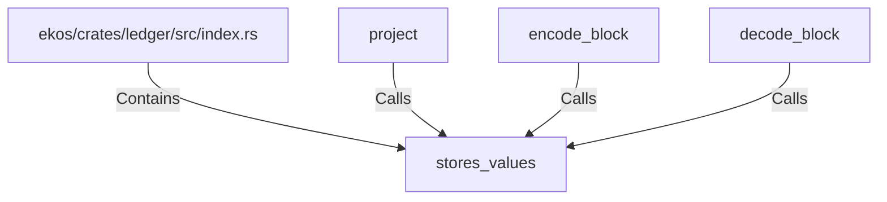

# stores_values (RustSymbol)

## Properties

| Key | Value |
|---|---|
| `kind` | function |

## Relationships

### Calls

- ← project (`775a5c11-b65e-541d-a531-4ca75476a2b6`)
- ← encode_block (`37e31f5f-37d3-5c9b-8e9a-9f783c727d76`)
- ← decode_block (`b8a0bf10-9570-574c-a274-53930cfd176b`)

### Contains

- ← ekos/crates/ledger/src/index.rs (`a43fa387-2cac-5166-bfc2-ae4c965fc2ac`)

## Diagram

## Evidence

_No evidence cited._
