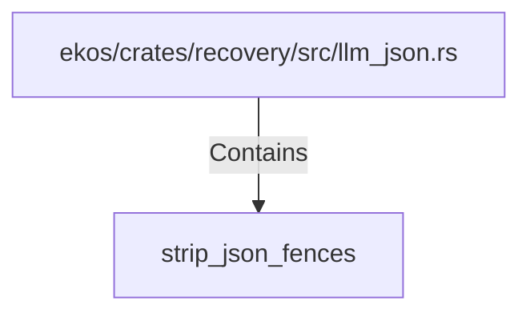

# strip_json_fences (RustSymbol)

## Properties

| Key | Value |
|---|---|
| `kind` | function |

## Relationships

### Contains

- ← ekos/crates/recovery/src/llm_json.rs (`880b7cea-f571-5e71-8a3d-29dc69a930f0`)

## Diagram

## Evidence

_No evidence cited._
