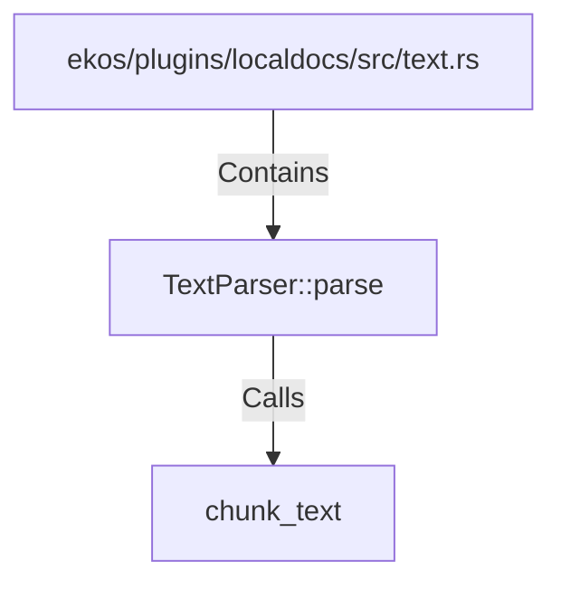

# TextParser::parse (RustSymbol)

## Properties

| Key | Value |
|---|---|
| `kind` | method |

## Relationships

### Calls

- → chunk_text (`2975a72f-8664-5803-89dd-e5ab5a6ad1e8`)

### Contains

- ← ekos/plugins/localdocs/src/text.rs (`fb7cfbed-8381-5078-b9d6-bc8b68af4e7d`)

## Diagram

## Evidence

_No evidence cited._
