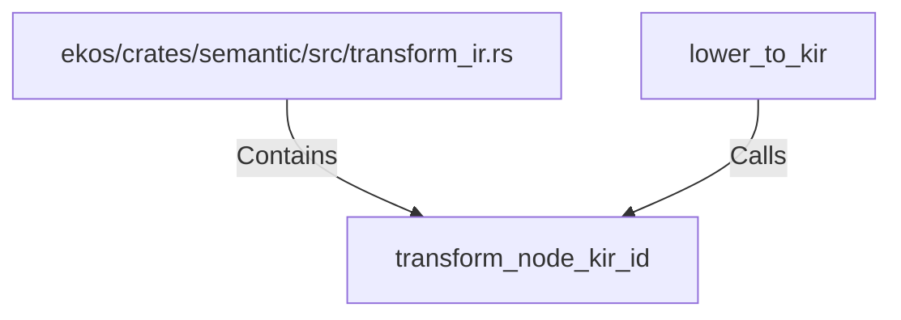

# transform_node_kir_id (RustSymbol)

## Properties

| Key | Value |
|---|---|
| `kind` | function |

## Relationships

### Calls

- ← lower_to_kir (`937c6e2d-efa6-5b74-bfcb-3bee881ee4ab`)

### Contains

- ← ekos/crates/semantic/src/transform_ir.rs (`b4fdd24c-8184-5879-9136-f0a70208955e`)

## Diagram

## Evidence

_No evidence cited._
