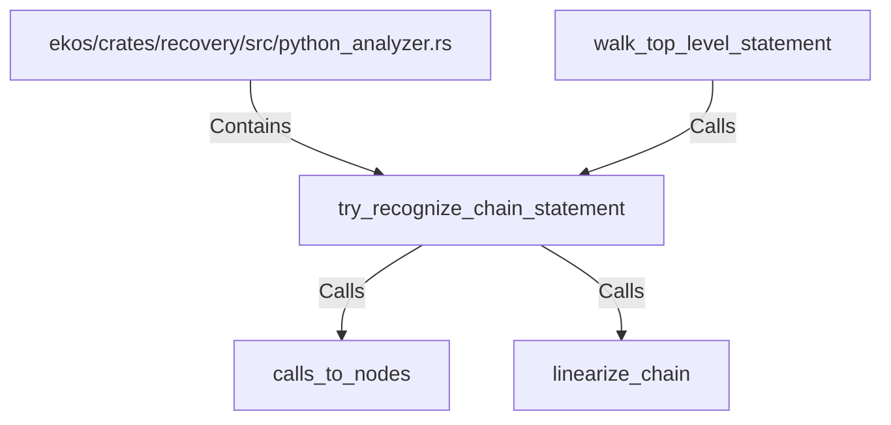

# try_recognize_chain_statement (RustSymbol)

## Properties

| Key | Value |
|---|---|
| `kind` | function |

## Relationships

### Calls

- ← walk_top_level_statement (`36a795d0-3788-5433-a369-2571af84e340`)
- → calls_to_nodes (`73d9612b-4af4-5e0f-b10f-ddfc27015e27`)
- → linearize_chain (`9a16b56c-b862-5655-af97-28a49dc6c15c`)

### Contains

- ← ekos/crates/recovery/src/python_analyzer.rs (`196ca3fd-e85c-5ab9-a142-50f63dc586b9`)

## Diagram

## Evidence

_No evidence cited._
