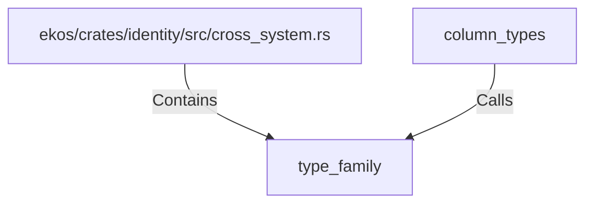

# type_family (RustSymbol)

## Properties

| Key | Value |
|---|---|
| `kind` | function |

## Relationships

### Calls

- ← column_types (`c13aa3d4-2f69-56d7-8b30-c643c78450ea`)

### Contains

- ← ekos/crates/identity/src/cross_system.rs (`44d130a8-ca02-506d-bc1a-21b037fb492c`)

## Diagram

## Evidence

_No evidence cited._
