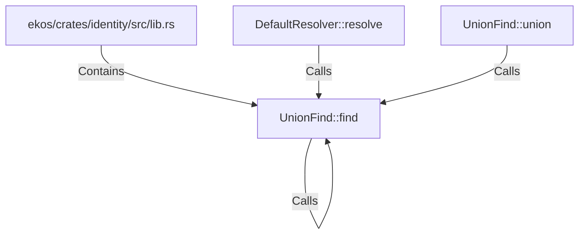

# UnionFind::find (RustSymbol)

## Properties

| Key | Value |
|---|---|
| `kind` | method |

## Relationships

### Calls

- ← DefaultResolver::resolve (`3372ccc3-1263-52f4-88b9-a8efc6cfa069`)
- → UnionFind::find (`023832e4-adcc-5b45-b48d-5c2f435f0546`)
- ← UnionFind::union (`a78faae3-7f4c-5699-95bf-ef8c6cf855a5`)

### Contains

- ← ekos/crates/identity/src/lib.rs (`c958282a-6d42-50ab-9cf9-8533976f0820`)

## Diagram

## Evidence

_No evidence cited._
