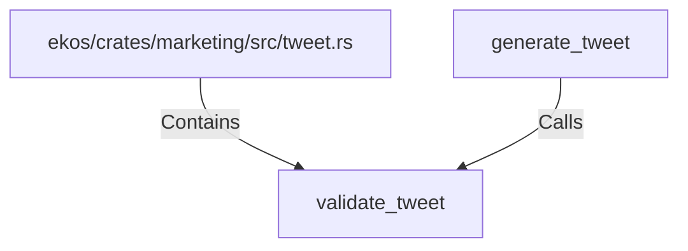

# validate_tweet (RustSymbol)

## Properties

| Key | Value |
|---|---|
| `kind` | function |

## Relationships

### Calls

- ← generate_tweet (`d45d31e2-f904-5009-8d24-d48d8d3b2063`)

### Contains

- ← ekos/crates/marketing/src/tweet.rs (`3372ee6e-2a1d-50b2-a3ae-b17eb421301b`)

## Diagram

## Evidence

_No evidence cited._
