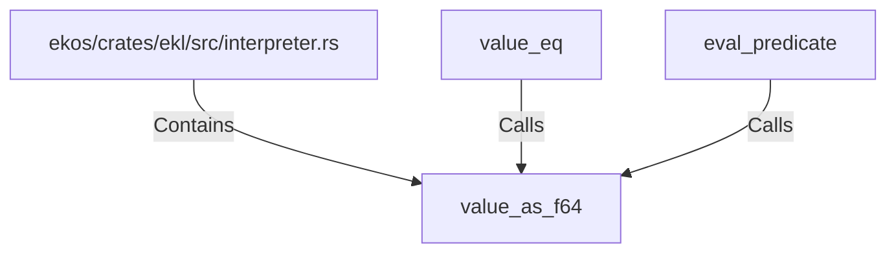

# value_as_f64 (RustSymbol)

## Properties

| Key | Value |
|---|---|
| `kind` | function |

## Relationships

### Calls

- ← value_eq (`92f87789-6991-562b-b876-73c822722296`)
- ← eval_predicate (`db424b5e-3b63-590d-8e63-197b48efa89a`)

### Contains

- ← ekos/crates/ekl/src/interpreter.rs (`9c2cb6e4-ee09-503f-8cf5-ccfaf23ecd79`)

## Diagram

## Evidence

_No evidence cited._
