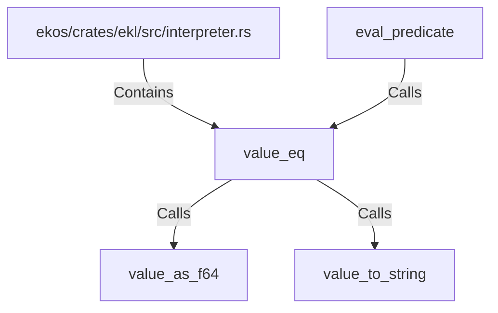

# value_eq (RustSymbol)

## Properties

| Key | Value |
|---|---|
| `kind` | function |

## Relationships

### Calls

- → value_as_f64 (`8613a3d6-5583-53a9-907c-c715f59b736e`)
- → value_to_string (`2b431c16-e299-5ca5-b60a-18aac4ca949f`)
- ← eval_predicate (`db424b5e-3b63-590d-8e63-197b48efa89a`)

### Contains

- ← ekos/crates/ekl/src/interpreter.rs (`9c2cb6e4-ee09-503f-8cf5-ccfaf23ecd79`)

## Diagram

## Evidence

_No evidence cited._
