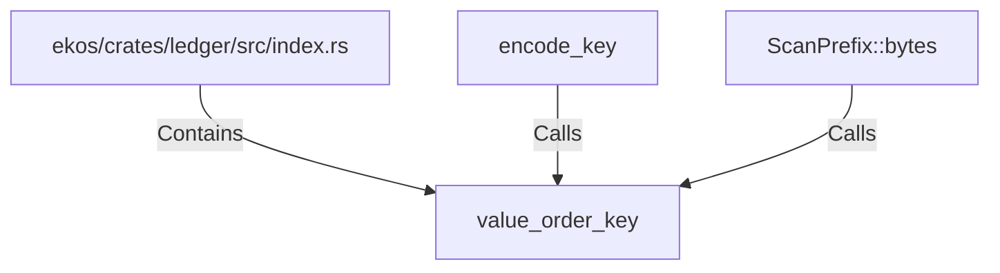

# value_order_key (RustSymbol)

## Properties

| Key | Value |
|---|---|
| `kind` | function |

## Relationships

### Calls

- ← encode_key (`5f3049a2-8e65-5510-9ee3-ab92690f254a`)
- ← ScanPrefix::bytes (`ca1b3e8c-f49b-5d36-a16e-a45d06960172`)

### Contains

- ← ekos/crates/ledger/src/index.rs (`a43fa387-2cac-5166-bfc2-ae4c965fc2ac`)

## Diagram

## Evidence

_No evidence cited._
