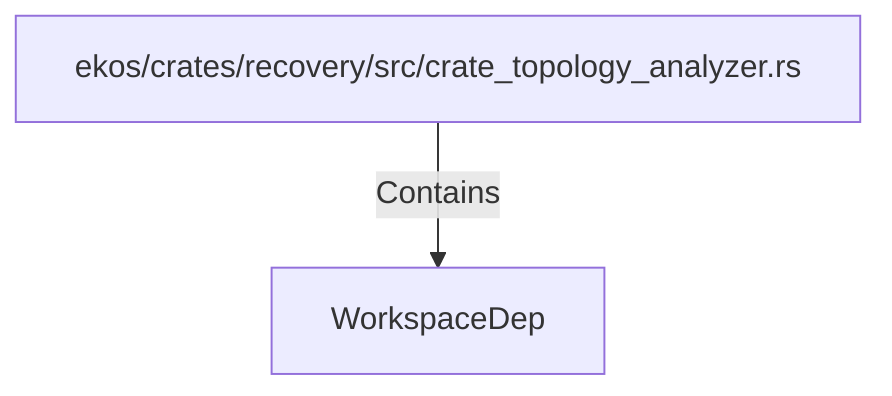

# WorkspaceDep (RustSymbol)

## Properties

| Key | Value |
|---|---|
| `kind` | enum |

## Relationships

### Contains

- ← ekos/crates/recovery/src/crate_topology_analyzer.rs (`83764758-1115-54df-bb75-4a49e7334245`)

## Diagram

## Evidence

_No evidence cited._
