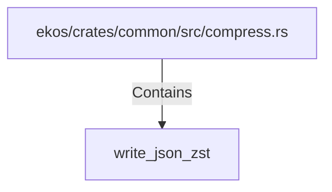

# write_json_zst (RustSymbol)

## Properties

| Key | Value |
|---|---|
| `kind` | function |

## Relationships

### Contains

- ← ekos/crates/common/src/compress.rs (`99637da4-0489-5fca-ba15-b1144f48c3cc`)

## Diagram

## Evidence

_No evidence cited._
