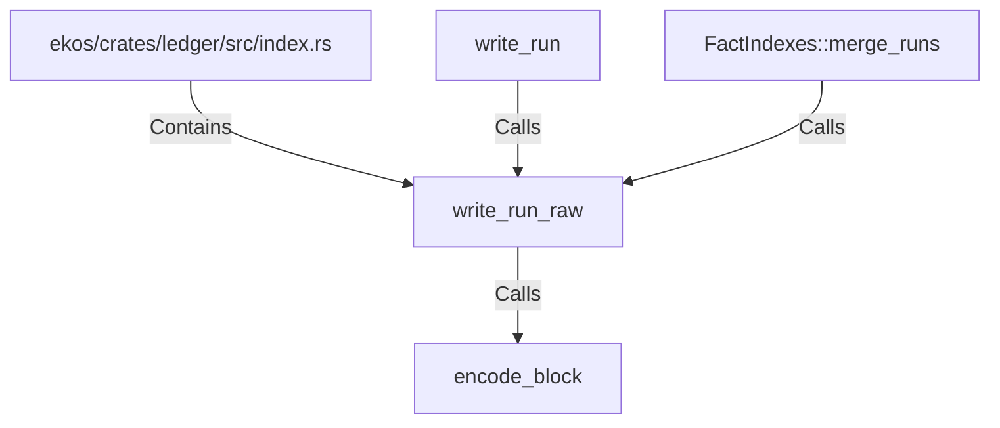

# write_run_raw (RustSymbol)

## Properties

| Key | Value |
|---|---|
| `kind` | function |

## Relationships

### Calls

- ← write_run (`944c015c-ad50-5e55-9238-7d57ee4ed67b`)
- → encode_block (`37e31f5f-37d3-5c9b-8e9a-9f783c727d76`)
- ← FactIndexes::merge_runs (`7656c624-f7b2-53e8-9af8-faafa094666c`)

### Contains

- ← ekos/crates/ledger/src/index.rs (`a43fa387-2cac-5166-bfc2-ae4c965fc2ac`)

## Diagram

## Evidence

_No evidence cited._
