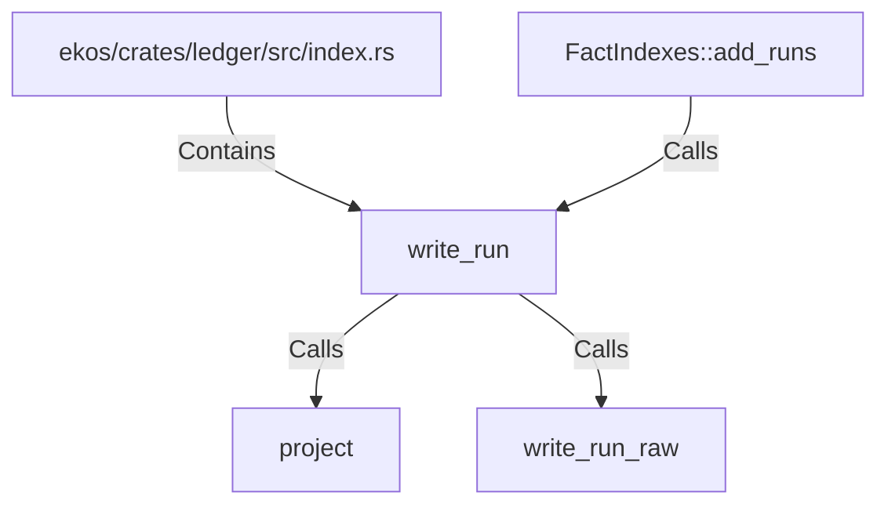

# write_run (RustSymbol)

## Properties

| Key | Value |
|---|---|
| `kind` | function |

## Relationships

### Calls

- → project (`775a5c11-b65e-541d-a531-4ca75476a2b6`)
- → write_run_raw (`be4b7353-317e-58f9-a870-099ca471e2d5`)
- ← FactIndexes::add_runs (`4f62bd8f-a002-5bbb-8bc9-5c708f2849a5`)

### Contains

- ← ekos/crates/ledger/src/index.rs (`a43fa387-2cac-5166-bfc2-ae4c965fc2ac`)

## Diagram

## Evidence

_No evidence cited._
